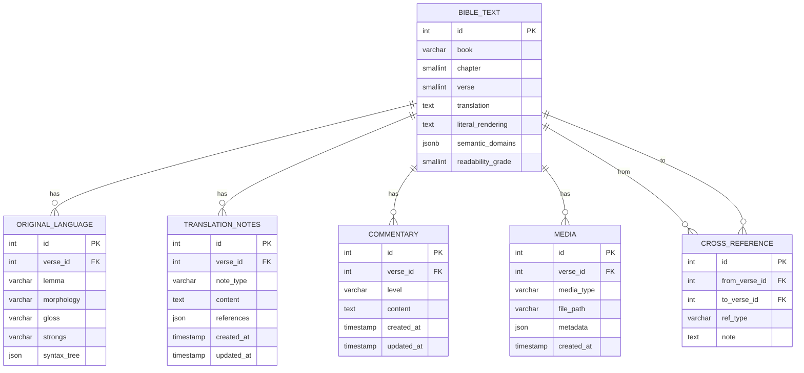

# AMSV Database Schema

```mermaid
erDiagram
    BIBLE_TEXT {
        int id PK
        varchar book
        smallint chapter
        smallint verse
        text translation
        text literal_rendering
        jsonb semantic_domains
        smallint readability_grade
    }

    ORIGINAL_LANGUAGE {
        int id PK
        int verse_id FK
        varchar lemma
        varchar morphology
        varchar gloss
        varchar strongs
        json syntax_tree
    }

    TRANSLATION_NOTES {
        int id PK
        int verse_id FK
        varchar note_type
        text content
        json references
        timestamp created_at
        timestamp updated_at
    }

    COMMENTARY {
        int id PK
        int verse_id FK
        varchar level
        text content
        timestamp created_at
        timestamp updated_at
    }

    MEDIA {
        int id PK
        int verse_id FK
        varchar media_type
        varchar file_path
        json metadata
        timestamp created_at
    }

    CROSS_REFERENCE {
        int id PK
        int from_verse_id FK
        int to_verse_id FK
        varchar ref_type
        text note
    }

    BIBLE_TEXT ||--o{ ORIGINAL_LANGUAGE : "has"
    BIBLE_TEXT ||--o{ TRANSLATION_NOTES : "has"
    BIBLE_TEXT ||--o{ COMMENTARY : "has"
    BIBLE_TEXT ||--o{ MEDIA : "has"
    BIBLE_TEXT ||--o{ CROSS_REFERENCE : "from"
    BIBLE_TEXT ||--o{ CROSS_REFERENCE : "to"
```
